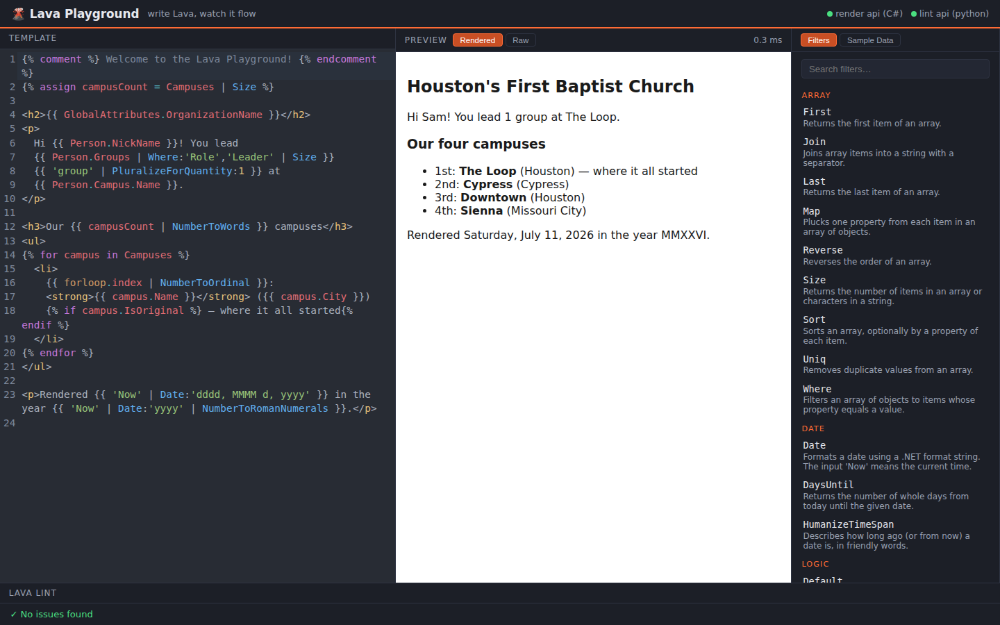

# 🌋 Lava Playground

*Write Lava, watch it flow.*

A three-language playground for [Rock RMS](https://www.rockrms.com/)-style **Lava** templates: type Lava on the left, see it render live on the right, and get lint feedback as you go. Like Rock's built-in Lava tester, but standalone, faster, and with a linter that tells you *what you meant to type*.



## Why this exists

Lava (Rock's dialect of Liquid) is easy to write and easy to typo. This repo is a sandbox for practicing it away from a live Rock instance, and a polyglot exercise: the same domain implemented across three stacks, each doing what it does best.

## Architecture

```
┌────────────────────┐     /api/render, /api/filters      ┌──────────────────────────┐
│  Vue 3 + TS + Vite │ ──────────────────────────────────▶ │  ASP.NET Core 8 (C#)     │
│  CodeMirror editor │                                     │  hand-rolled Lava engine │
│  live preview      │     /lint                           └──────────────────────────┘
│  lint panel        │ ──────────────────────────────────▶ ┌──────────────────────────┐
└────────────────────┘                                     │  FastAPI (Python)        │
                                                           │  Lava static analysis    │
                                                           └──────────────────────────┘
```

The three services and what each one does:

**`api/` — the render engine (C#, ASP.NET Core 8).** A Lava/Liquid template engine written from scratch: tokenizer, recursive-descent parser, and evaluator, with **zero NuGet dependencies** (see `api/nuget.config`; the whole solution restores offline). It supports `{{ output | Filter:'arg' }}`, `assign`, `capture`, `comment`, `if/elsif/else`, `unless`, and `for` (with `reversed`, `limit:n`, and the `forloop` object), plus ~48 filters including Rock favorites like `Humanize`, `Possessive`, `Pluralize`, `NumberToOrdinalWords`, and `NumberToRomanNumerals`. Templates render against a Rock-shaped sample context (a Person, Campuses, Groups, Events, GlobalAttributes).

**`linter/` — the lint service (Python, FastAPI).** Static analysis that the renderer itself can't give you: unclosed blocks with the line number of the tag that opened them, mismatched ``/``, orphaned ``, unknown filters with did-you-mean suggestions (`Upcaze` → *did you mean "Upcase"?*), and PascalCase style nudges.

**`frontend/` — the playground (Vue 3, TypeScript, Vite).** A CodeMirror 6 editor with Liquid syntax highlighting, a debounced live preview (rendered HTML or raw output), a searchable filter reference fetched from the API (click a filter to insert an example), the sample data viewer, and the lint panel.

## Running it

### With Docker

```bash
docker compose up --build
```

Then open <http://localhost:5173>.

### Locally (three terminals)

```bash
# 1. Render API  → http://localhost:5133
dotnet run --project api/LavaPlayground.Api

# 2. Lint service → http://localhost:8000
cd linter && pip install -r requirements.txt && uvicorn app.main:app --port 8000

# 3. Frontend → http://localhost:5173 (proxies /api and /lint)
cd frontend && npm install && npm run dev
```

## Tests

```bash
# C# engine: 91 assertions in a dependency-free console harness
dotnet run --project api/LavaPlayground.Tests

# Python linter
cd linter && pip install -r requirements-dev.txt && python -m pytest tests

# Frontend typecheck + build
cd frontend && npm run build
```

CI runs all three on every push (`.github/workflows/ci.yml`).

## API reference

`POST /api/render` renders a template against the sample context; pass a `context` object to merge your own values on top.

```bash
curl -s localhost:5133/api/render \
  -H 'Content-Type: application/json' \
  -d '{"template": "{{ Person.NickName | Possessive }} {{ 3 | NumberToOrdinalWords }} group"}'
# → {"output":"Sam's third group","elapsedMs":0.4,"error":null}
```

`GET /api/filters` lists every filter with a description and example. `GET /api/sample-context` returns the sample data. `POST /lint` (port 8000) returns issues with line/col positions, severities, and suggestions.

## Design notes

The engine intentionally implements a *subset* of real Lava: no entity commands, no shortcodes, no ``. Truthiness follows Liquid rules (only `null` and `false` are falsy), `and` binds tighter than `or`, and comparisons are numeric when both sides parse as numbers. Property access is case-insensitive to be friendly to JSON contexts. The linter's known-filter list mirrors the C# registry; `GET /api/filters` is the source of truth if the two ever drift.

Built for fun, learning, and the glory of well-formed templates.
