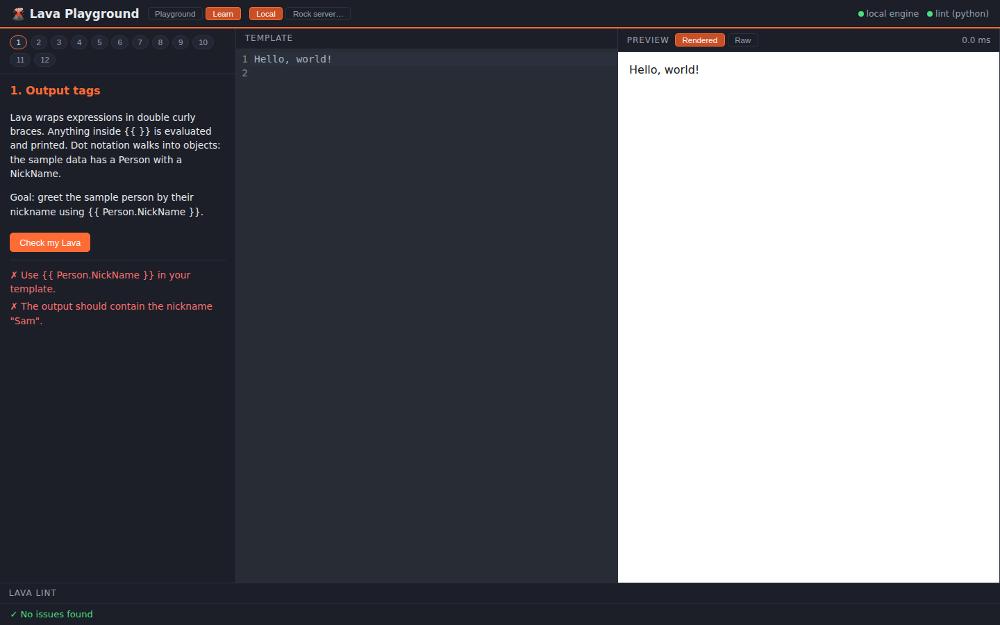

# 🌋 Lava Playground

*Write Lava, watch it flow.*

A three-language playground for [Rock RMS](https://www.rockrms.com/) **Lava** templates: type Lava on the left, see it render live on the right, get lint feedback as you go, and flip a switch to run your template on your **real Rock server**. There's also a guided Learn mode that teaches Lava lesson by lesson.


## Features

**Two render engines.** The default is a local Lava engine written from scratch in C# (no Rock required, safe to experiment). Toggle to *Rock server* mode, point it at your instance, and templates render through Rock's `POST /api/Lava/RenderTemplate` REST endpoint instead; entity commands, `CurrentPerson`, attribute filters, and Rock's complete filter set all behave exactly as they will in production, because they run on your actual server.

**120 filters offline.** The local engine covers the non-entity portion of Rock's filter documentation: Text (Truncate, Possessive, Pluralize/Singularize, RegEx*, Linkify, FromMarkdown, ReadTime, ObfuscateEmail...), Numeric (FormatAsCurrency, AtLeast/AtMost, Round, NumberToRomanNumerals...), Date (DateAdd, DateDiff, HumanizeDateTime, SundayDate...), Collection (Where, Select, Sort, GroupBy, Distinct, Take/Skip, Sum, AddToArray, AddToDictionary...), Type coercion (AsBoolean/AsInteger/AsDateTime, ToJSON/FromJSON, Debug), and the full Color category (Lighten, Darken, Mix, Tint, Shade...). Tags: `assign`, `capture`, `comment`, `raw`, `if/elsif/else`, `unless`, `case/when`, and `for` with `reversed`, `limit:n`, dictionary iteration, and the `forloop` object.

**A linter that knows Rock.** The Python service reports unclosed blocks with the line that opened them, mismatched end tags, orphaned `else`/`when`, unknown filters with did-you-mean suggestions, and, for entity-bound filters and command tags like `Attribute`, `PersonById`, ``, or ``, an info notice that they need a connected Rock server rather than a false "unknown" error. The known-filter list self-syncs from the render API at startup.

**Learn mode.** Twelve lessons from your first `{{ output }}` to a capstone combining assign, loops, and conditionals. Each lesson has a goal, a Check button that validates both your template and its rendered output, and progress that persists between visits.



## Architecture

```
┌────────────────────┐   /api/render, /api/filters   ┌──────────────────────────┐
│  Vue 3 + TS + Vite │ ─────────────────────────────▶ │  ASP.NET Core 8 (C#)     │
│  CodeMirror editor │   /api/rock/*                  │  hand-rolled Lava engine │──▶ your Rock server
│  live preview      │                                └──────────────────────────┘    /api/Lava/RenderTemplate
│  learn mode        │   /lint                        ┌──────────────────────────┐
└────────────────────┘ ─────────────────────────────▶ │  FastAPI (Python)        │
                                                      │  Lava static analysis    │
                                                      └──────────────────────────┘
```

The C# solution has **zero NuGet dependencies** (see `api/nuget.config`); the engine, the test harness, and the Rock proxy are all framework-only, so it restores and builds fully offline.

## Connecting to your Rock server

Click *Rock server…* in the top bar and provide either a **REST API key** (Admin Tools → Security → REST Keys; sent as the `Authorization-Token` header) or a **username/password** (uses `POST /api/Auth/Login` and the `.ROCK` cookie). The backend proxies every render to `POST /api/Lava/RenderTemplate` on your server, verifies the connection with a probe render, and keeps credentials in process memory only; nothing is written to disk.

Notes: the account or REST key needs access to the Lava RenderTemplate endpoint (it's restricted to admins by default; check Admin Tools → Security → REST Controllers), and entity commands inside templates are governed by your server's Lava command security, exactly as in production.

## Running it

### With Docker

```bash
docker compose up --build
```

Then open <http://localhost:5173>.

### Locally (three terminals)

```bash
# 1. Render API  → http://localhost:5133
dotnet run --project api/LavaPlayground.Api

# 2. Lint service → http://localhost:8000
cd linter && pip install -r requirements.txt && uvicorn app.main:app --port 8000

# 3. Frontend → http://localhost:5173 (proxies /api and /lint)
cd frontend && npm install && npm run dev
```

## Tests

```bash
# C# engine: 162 assertions in a dependency-free console harness
dotnet run --project api/LavaPlayground.Tests

# Python linter (30 tests)
cd linter && pip install -r requirements-dev.txt && python -m pytest tests

# Frontend typecheck + build
cd frontend && npm run build
```

CI runs all three on every push (`.github/workflows/ci.yml`).

## API reference

`POST /api/render` renders against the built-in sample context (merge your own values via a `context` object). `GET /api/filters` lists every filter with description and example. `GET /api/sample-context` returns the sample data. `POST /api/rock/connect`, `GET /api/rock/status`, `POST /api/rock/render`, and `POST /api/rock/disconnect` manage the remote connection. `POST /lint` (port 8000) returns issues with line/col positions, severities, and suggestions.

```bash
curl -s localhost:5133/api/render \
  -H 'Content-Type: application/json' \
  -d '{"template": "{{ Campuses | Sum:'"'"'Attendance'"'"' | FormatAsCurrency }}"}'
# → {"output":"$4,950.00","elapsedMs":0.5,"error":null}
```

## Design notes

The local engine implements the subset of Lava that makes sense without a database; anything entity-bound belongs to remote mode. Truthiness follows Liquid rules (only `null` and `false` are falsy), `and` binds tighter than `or`, comparisons go numeric when both sides parse as numbers, and property access is case-insensitive to be friendly to JSON contexts. Where a Rock filter's exact output could not be verified against a live instance (e.g. `ObfuscateEmail` masking style), the behavior is a documented approximation; remote mode is always the source of truth.

Built for fun, learning, and the glory of well-formed templates.
